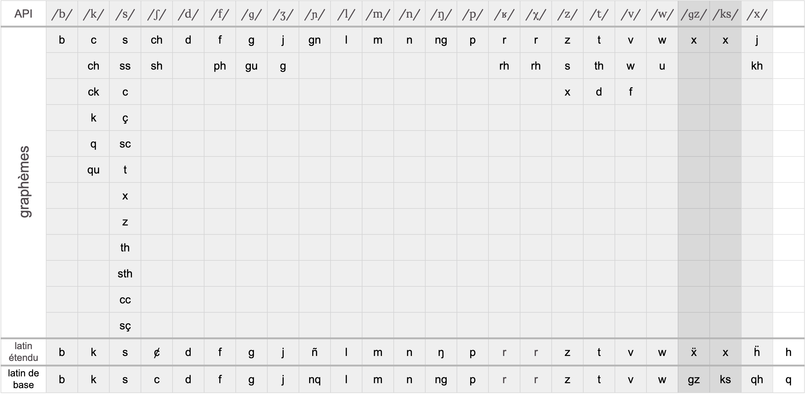

= Introduction

:homographie: https://fr.wikipedia.org/wiki/Homographe[homographie]
:homophonie: https://fr.wikipedia.org/wiki/Homophonie[homophonie]

Tout est parti d'un constat et d'une question qui me taraude depuis quelque
temps…

Mon constat est le suivant : il est difficile, à la lecture d'un mot, d'en
deviner la prononciation. Il en est d'ailleurs certains qui, sans contexte,
pourraient tout aussi bien se prononcer de deux manières différentes ; on parle
ici d'{homographie}. De même, il
est tout aussi difficile, à l'énoncé d'un mot, d'en deviner la graphie ; on
parle alors d'{homophonie}.

— Et la question ? » me direz-vous.

:API: https://fr.wikipedia.org/wiki/Alphabet_phonétique_international[Alphabet Phonétique International]

N'ayant aucune formation littéraire, et encore moins linguistique, la question
que je me pose à chaque fois que j'ouvre un dictionnaire est :

> Comment diantre est-on censé lire cette prose absconse accolée à chaque mot du
dictionnaire et qui, si j'avais quelque notion de ce qu'est l'{API} (API),
m'aiderait à en comprendre la prononciation !?

Alors je me suis essayé à un petit jeu : concevoir une orthographe phonologique de la
langue française. Et c'est en m'aidant de l'API pour énumérer l'ensemble des
phonèmes — et des graphèmes qui leur sont liés — qu'ont vu le jour _Akarlãg_ et
_Akarlahg_.

== Règles du jeu

:liaisons: https://fr.wikipedia.org/wiki/Liaison_en_français[liaisons]
:accords: https://fr.wikipedia.org/wiki/Accord_(grammaire)[accords]
:nombre: https://fr.wikipedia.org/wiki/Nombre_grammatical[nombre]
:phoneme: https://fr.wikipedia.org/wiki/Phonème[phonème]

Pour ce faire, je me suis imposé quelques règles.

. Premièrement, à chaque symbole correspondra un unique {phoneme}, et pour
  chaque phonème, un seul symbole lui correspondra ;
. Deuxièmement, la graphie devra rester aussi proche de l'orthographe standard
  de la langue française que faire se peut ;
. Enfin, devront être gérés les {liaisons} et les {accords} de {nombre}.

== API

:prononciation: https://www.wikiwand.com/fr/Prononciation_du_français[prononciation]

La langue française dispose finalement de peu de phonèmes au regard de la
multitude recensée. On en distinguera 37 en tout et pour tout pour la
{prononciation} du français de France. Cette liste s'allonge si l'on considère
le français québécois, de Belgique ou de Suisse.

=== Voyelles

:voyelles: https://www.phonetique.ulaval.ca/identification-des-sons-du-francais/voyelles/[voyelles]
:nasalisation: https://www.wikiwand.com/fr/Nasalisation[nasalisation]

On distingue en français 12 {voyelles}, auxquelles s'en ajoutent 4 autres par
{nasalisation} : /ɔ̃/ (on), /ɛ̃/ (brin), /œ̃/ (brun) et /ɑ̃/ (an).


=== Consonnes

:consonnes: https://www.phonetique.ulaval.ca/identification-des-sons-du-francais/les-consonnes/[consonnes]

Les {consonnes} de la langue française sont quant à elles au nombre de 20,
auxquelles s'ajoutent la consonne pulmonique /ɥ/.


== Akarlãg / Akarlahg

:digrammes: https://fr.wikipedia.org/wiki/Digramme[digrammes]
:diacritiques: https://fr.wikipedia.org/wiki/Diacritique[diacritiques]

Deux lettres de l'alphabet latin ne sont utilisées ici que pour la réalisation
de {digrammes} permettant l'écriture sans {diacritiques}. Il s'agit du *h* et du
*q*. La première étant utilisée dans le cas de digrammes sur la base de
voyelles, et la seconde pour ceux basés sur des consonnes.

=== Vwȧèl' / Vwayhel'


=== Kõson' / Kohson'



== Transcription

Un petit utilitaire en ligne de commande est disponible pour transcrire un texte
en Akarlãg ou en Akarlahg depuis la notation alphabétique phonétique
internationale. Et inversement.

=== Usage

```sh
❯./bin/akarlahg --help

Usage: bin/akarlahg [options] string
    -f, --from=SRC                   Convert text from SRC (ipa, utf8, latin)
    -t, --to=DEST                    Convert text to DEST (ipa, utf8, latin)
    -h, --help                       Prints this help
```

==== Exemples

```sh
❯ bin/akarlahg -f ipa -t utf8 "dɛ nɔɛl u œ̃ zefiʁ aj mə vɛ də ɡlasɔ̃ vyʁmjɛ̃ ʒə din dɛkski ʁoti də bœf o kiʁ a lˈaj dˈaʒ myʁ et seteʁa"

dè noèl ů ũ zéfir ȧ me vè de glasõ vurmyũ je din dèxki rôti de bœf ô kir a lȧ daj mur ét sétéra
```

```sh
❯ bin/akarlahg -f ipa -t latin "dɛ nɔɛl u œ̃ zefiʁ aj mə vɛ də ɡlasɔ̃ vyʁmjɛ̃ ʒə din dɛkski ʁoti də bœf o kiʁ a lˈaj dˈaʒ myʁ et seteʁa"

dhe nohel hu uh zehfir ay me vhe de glasoh vurmyuh je din dhekski roti de bef o kir a lay daj mur eht sehtehra
```

NOTE: Ce script n'en est qu'à ses balbutiements. +
      Il ne permet pas la transcription depuis (ni vers) un texte orthographié
      de façon standard. +
      Il ne gère correctement ni les liaisons, ni les pluriels.
